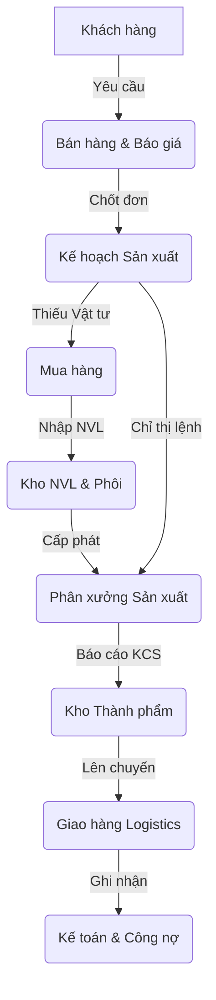

## Sơ đồ Tổng Quan Hệ Thống

```mermaid
flowchart TD
    A[Khách hàng] -->|Yêu cầu| B(Bán hàng & Báo giá)
    B -->|Chốt đơn| C(Kế hoạch Sản xuất)
    C -->|Thiếu Vật tư| D(Mua hàng)
    D -->|Nhập NVL| E(Kho NVL & Phôi)
    E -->|Cấp phát| F(Phân xưởng Sản xuất)
    C -->|Chỉ thị lệnh| F
    F -->|Báo cáo KCS| G(Kho Thành phẩm)
    G -->|Lên chuyến| H(Giao hàng Logistics)
    H -->|Ghi nhận| I(Kế toán & Công nợ)
```

> Vui lòng dùng thanh Menu bên trái (Sidebar) để chuyển đến Hướng dẫn của phòng ban bạn.
