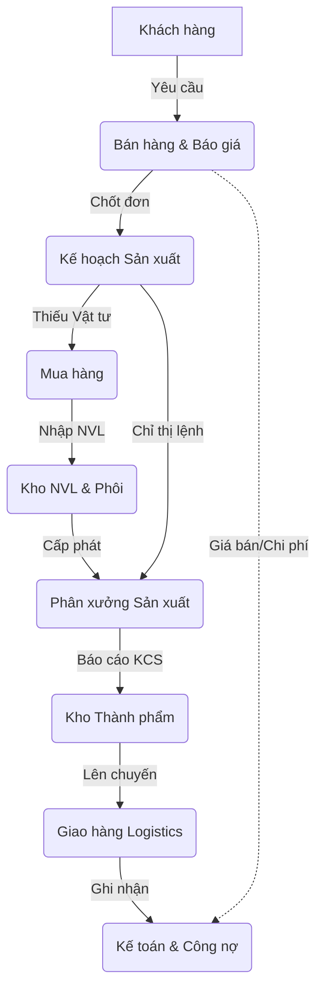

# TÀI LIỆU HƯỚNG DẪN SỬ DỤNG - NAM PHƯƠNG ERP

Chào mừng bạn đến với tài liệu hướng dẫn sử dụng Hệ thống Nam Phương ERP. Tài liệu này được thiết kế để giúp mọi bộ phận (Bán hàng, Mua hàng, Sản xuất, Kho, Kế toán, Nhân sự) nắm bắt logic vận hành và thao tác trơn tru trên phần mềm.

## 1. Tổng quan hệ thống ERP Nam Phương

Hệ thống ERP Nam Phương là một chuỗi cung ứng khép kín, trong đó dữ liệu chảy liên tục từ Khách hàng → Báo giá → Đơn hàng → Sản xuất → Kho → Giao hàng → Kế toán.

## 2. Ai nên đọc phần nào?

Tài liệu được chia thành các phân hệ tương ứng với chức năng nghiệp vụ:

| Bộ phận / Đối tượng | File Hướng dẫn cần đọc | Link nhanh |
| :--- | :--- | :--- |
| **Sales / NVKD** | Cách làm báo giá, quản lý đơn hàng SO, theo dõi tiến độ. | [01_BanHang_BaoGia.md](./01_BanHang_BaoGia.md) |
| **Mua hàng (Purchasing)** | Đề xuất mua vật tư, làm PO, theo dõi NCC, đối soát kho. | [02_MuaHang_Kho.md](./02_MuaHang_Kho.md) |
| **Thủ kho (Warehouse)** | Nhập/Xuất kho, chuyển kho, thẻ kho, kiểm kê tồn kho. | [02_MuaHang_Kho.md](./02_MuaHang_Kho.md) |
| **Quản đốc / Công nhân** | Xem lệnh SX, nhận phôi, thao tác màn hình CD2 (Scan mã). | [03_SanXuat.md](./03_SanXuat.md) |
| **Kế toán (Accounting)** | Thu chi, đối công nợ, tính giá thành, xuất hóa đơn. | [04_KeToan_NhanSu.md](./04_KeToan_NhanSu.md) |
| **Hành chính (HR)** | Chấm công, tính lương, quản lý nghỉ phép, phân quyền. | [04_KeToan_NhanSu.md](./04_KeToan_NhanSu.md) |
| **Ban Giám Đốc** | Báo cáo PNL, Tồn kho, Dòng tiền, Hệ thống AI Agent. | [05_BaoCao_HeThong.md](./05_BaoCao_HeThong.md) |

> [!TIP]
> **Quy tắc vàng:** Dữ liệu đầu vào của bộ phận này là đầu ra của bộ phận trước đó. Việc nhập liệu chính xác tại khâu Bán hàng (Kích thước, Số lớp, Sóng) sẽ quyết định sự chính xác của toàn bộ quy trình Sản xuất và Tính giá thành.

## 3. Cách tra cứu tài liệu
- Tài liệu sử dụng các hộp cảnh báo để nhấn mạnh:
  - `[IMPORTANT]`: Điều bắt buộc phải làm.
  - `[WARNING]`: Các lỗi thường gặp.
  - `[TIP]`: Mẹo thao tác nhanh.
- Hãy mở file `.md` tương ứng với phòng ban của bạn để bắt đầu.

---
*Cập nhật lần cuối: Hôm nay*
