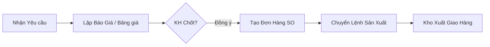

# HƯỚNG DẪN SỬ DỤNG - BÁN HÀNG & BÁO GIÁ (SALES)

Phân hệ Bán hàng là cửa ngõ đầu tiên của ERP. Mọi thông số (kích thước, loại giấy, định lượng) đều phải chuẩn xác 100% để bộ phận Sản xuất có thể làm đúng.

## 1. Mục tiêu Nghiệp vụ
- Lập Báo giá nhanh, chính xác (Hệ thống hỗ trợ tự động tính giá dựa trên diện tích, loại sóng, chi phí cố định).
- Theo dõi Đơn hàng Bán (SO - Sales Order) và Lịch giao hàng.
- Chăm sóc Khách hàng & Ghi nhận hàng bán trả lại.

## 2. Quy trình Cốt lõi

## 3. Hướng dẫn Thao tác Chi tiết

### 3.1. Lập Báo Giá (Quotation)
Tính năng báo giá giúp NVKD tính nhanh giá thùng/hộp carton dựa trên thông số kỹ thuật, tránh sai sót thủ công.

**Các bước thực hiện:**
1. Truy cập **Bán hàng & Báo giá > Danh sách Báo giá** (`/quotes`).
2. Nhấn nút **[+ Thêm báo giá mới]**.
3. **Thông tin chung:**
   - Chọn Khách hàng (Nếu khách mới, phải tạo trong `Danh mục > Khách hàng` trước).
   - Điền Ngày hiệu lực, Nhân viên phụ trách.
4. **Chi tiết Báo giá (Quan trọng nhất):**
   - Chọn Sản phẩm hoặc Thêm mới tự do.
   - Nhập Kích thước (Dài x Rộng x Cao) tính bằng `mm` hoặc `cm` (Chú ý đơn vị trên màn hình).
   - Chọn Số lớp (3 lớp, 5 lớp, 7 lớp) và Tổ hợp sóng (A, B, C, BC...).
   - Nhập Số lượng yêu cầu.
   - *Logic hệ thống:* Hệ thống sẽ tự động gọi tới công thức định giá (Costing Engine) để tính ra **M2**, **Trọng lượng**, **Chi phí vật tư**, **Biên độ lợi nhuận** và gợi ý **Đơn giá bán**.
5. Nhấn **[Lưu & In Báo Giá]**. Màn hình sẽ chuyển sang giao diện Print Template để xuất PDF gửi khách.

> [!IMPORTANT]
> **Biên độ lợi nhuận (Margin):** Bạn có thể điều chỉnh Đơn giá bán cuối cùng, nhưng hệ thống sẽ cảnh báo đỏ nếu giá bán thấp hơn Giá vốn dự tính. Chỉ Cấp quản lý mới được duyệt báo giá có Margin < mức sàn (ví dụ: < 10%).

### 3.2. Tạo Đơn Bán Hàng (Sales Order - SO)
Khi khách hàng chốt báo giá, bạn phải tạo SO để ghi nhận doanh thu dự kiến và kích hoạt Sản xuất.

**Các bước thực hiện:**
1. Mở Báo giá đã chốt, nhấn nút **[Tạo Đơn Hàng SO]** ở góc phải trên. Hệ thống sẽ tự động copy toàn bộ dữ liệu (không cần gõ lại).
2. HOẶC vào **Bán hàng > Đơn bán hàng** (`/sales/orders/new`) để tạo tay.
3. Bổ sung các trường bắt buộc cho Giao hàng:
   - **Ngày giao hàng dự kiến** (Rất quan trọng cho bộ phận Điều độ Sản xuất).
   - **Địa chỉ giao hàng thực tế** (Để kho xếp xe).
4. Nhấn **[Lưu và Chuyển lệnh SX]**.

> [!TIP]
> **Trạng thái Đơn hàng:**
> - `MỚI`: Đơn vừa tạo, có thể sửa.
> - `ĐANG SẢN XUẤT`: Đã có Lệnh Sản Xuất (PO), KHÔNG thể sửa thông số kỹ thuật.
> - `ĐÃ GIAO XONG`: Thủ kho đã xuất kho và tài xế đã xác nhận.

### 3.3. Theo dõi Giao hàng & Công nợ
- Dùng tính năng **Báo cáo Tiến độ Đơn hàng** (`/reports/order-progress`) để xem đơn SO nào đã chạy tới công đoạn nào (In, Bế, Đóng gói) mà không cần xuống xưởng hỏi.
- Khi hàng được xuất đi, phần mềm tự động tạo **Phiếu Xuất Kho Bán Hàng**, và Kế toán sẽ kéo dữ liệu này để ra Hóa đơn (Sales Invoice).

### 3.4. Xử lý Hàng Bán Trả Lại (Sales Returns)
Nếu hàng lỗi, khách trả lại:
1. Vào **Bán hàng > Hàng bán trả lại** (`/sales/returns/create`).
2. Chọn phiếu SO gốc.
3. Điền Số lượng trả lại và **Lý do trả hàng** (rất quan trọng để trừ KPI Sản xuất/Kho).
4. Lưu phiếu. Kho sẽ tự động nhận được yêu cầu nhập lại hàng lỗi (Kho Hàng Lỗi).

---
*Tiếp theo: [Hướng dẫn Mua hàng & Quản lý Kho](./02_MuaHang_Kho.md)*
