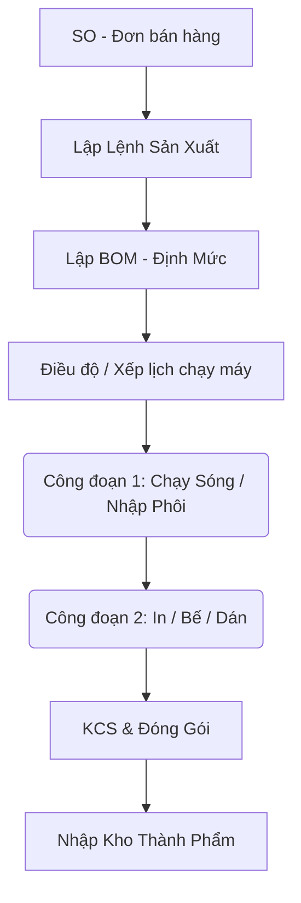

# HƯỚNG DẪN SỬ DỤNG - SẢN XUẤT & ĐIỀU ĐỘ (PRODUCTION & CD2)

Phân hệ Sản xuất của Nam Phương ERP được thiết kế cực kỳ chuyên sâu cho ngành Bao bì Carton (chia thành Công đoạn 1 chạy sóng và Công đoạn 2 In/Bế/Đóng gói). Đây là "trái tim" của nhà máy.

## 1. Mục tiêu Nghiệp vụ
- Số hóa Lệnh sản xuất (Production Order) thay vì dùng giấy truyền tay.
- Lên lịch chạy máy (Queue/Kanban) tối ưu để giảm thời gian chờ, giảm hao hụt.
- Đo lường năng suất (KCS) thời gian thực tại từng máy bằng thiết bị di động / Máy quét mã vạch.

---

## 2. Quy Trình Tổng Quan Lệnh Sản Xuất

## 3. Điều Độ Sản Xuất (Quản Đốc / Kế Hoạch)

### 3.1. Lập Lệnh & Lên Kế Hoạch (Production Plans)
1. Khi có Đơn hàng SO, quản đốc vào **Sản xuất > Kế hoạch SX** (`/production/plans/new`).
2. Chọn các đơn hàng cần sản xuất.
3. Phần mềm sẽ tạo Lệnh SX chứa **BOM (Bill of Materials)** - Ghi rõ định mức cần xuất bao nhiêu m2 phôi sóng, dùng giấy gì, tốn bao nhiêu kg mực.
4. Quản đốc có thể In lệnh (bản PDF mã vạch) để đưa xuống xưởng.

### 3.2. Sắp Xếp Máy In / Máy Bế (Kanban Board)
Thay vì dùng bảng mica viết phấn, xưởng dùng tính năng **Hàng Đợi Máy In / Kanban** (`/production/cd2/sauin-kanban`).
- Màn hình hiển thị dạng kéo-thả (Drag & Drop) giống Trello.
- **Cột:** Tên từng máy in (Máy In 1 màu, In 3 màu, Máy Bế tròn, Bế phẳng).
- **Thẻ (Card):** Là các Lệnh sản xuất.
- Kế toán xưởng / Quản đốc chỉ việc **kéo thẻ lệnh vào đúng máy** và xếp thứ tự ưu tiên (Lệnh nào chạy trước để lên trên). Các máy dưới xưởng sẽ cập nhật tức thời (Real-time).

---

## 4. Thao Tác Dành Cho Công Nhân (Mobile Tracking)

Nam Phương ERP có giao diện riêng dành cho công nhân đứng máy (chữ to, nút bấm chạm vuốt dễ dàng trên Tablet hoặc Mobile).

### 4.1. Đăng nhập Máy (Machine Login)
1. Công nhân truy cập `/cd2/machine-login`.
2. Chọn tên Máy (Ví dụ: Máy In Flexo 3).
3. Đăng nhập bằng mã PIN hoặc quét thẻ nhân viên.

### 4.2. Khai báo Năng suất (KCS)
Khi công nhân mở màn hình lên, họ sẽ thấy ĐÚNG cái Lệnh mà Quản đốc đã kéo thả cho họ.
1. Nhấn nút **[BẮT ĐẦU CHẠY]**. Phần mềm bắt đầu bấm giờ (Tính lead-time và OEE).
2. Khi chạy xong, công nhân nhấn **[KẾT THÚC]** và nhập 2 con số:
   - **Số lượng Tốt (Đạt KCS):** Máy tự động truyền dữ liệu lên Kho Thành phẩm.
   - **Số lượng Hỏng (Phế):** Hệ thống ghi nhận hao hụt để trừ điểm KPI.
3. Nếu dùng Scanner, công nhân chỉ cần cầm máy quét chíp mã vạch trên phiếu lệnh, hệ thống sẽ tự điền form.

> [!IMPORTANT]
> **Nhập Kho Tự Động:** Khi công đoạn cuối cùng (Đóng gói) bấm KẾT THÚC và ghi nhận SL Tốt, hệ thống tự động sinh ra **Phiếu Nhập Kho Thành Phẩm** cho Thủ kho (Thủ kho không cần nhập tay nữa).

---
*Tiếp theo: [Hướng dẫn Kế toán & Nhân sự](./04_KeToan_NhanSu.md)*
