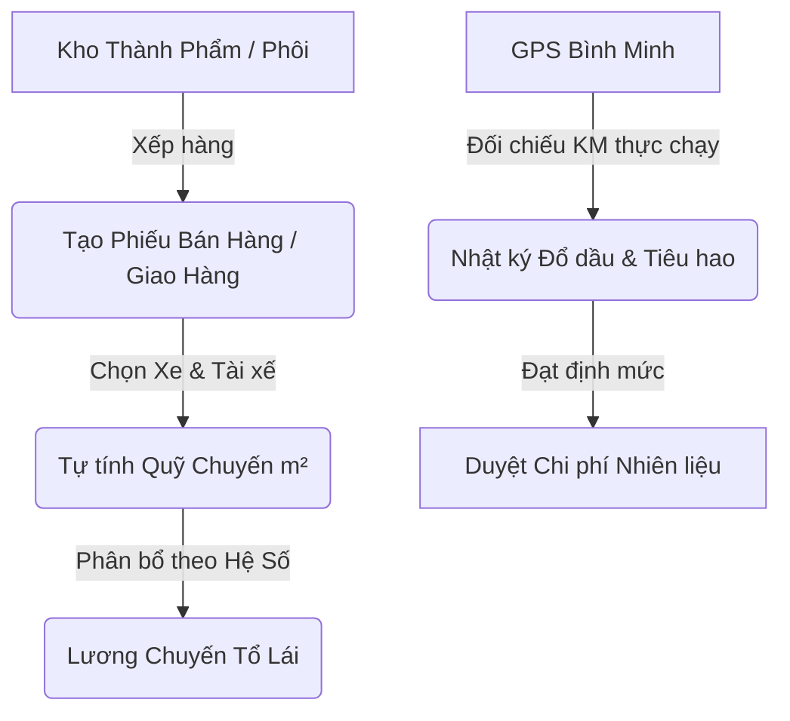

# HƯỚNG DẪN SỬ DỤNG - LOGISTICS & QUẢN LÝ ĐỘI XE (FLEET MANAGEMENT & GPS)

Phân hệ Logistics & Quản lý Đội xe là cầu nối cuối cùng của ERP Nam Phương, chịu trách nhiệm vận chuyển thành phẩm carton đến khách hàng, kiểm soát chi phí nhiên liệu và tự động tính lương chuyến cho tổ lái (Tài xế & Lơ xe). 

Để chống thất thoát xăng dầu và minh bạch hóa số KM thực chạy, hệ thống kết hợp chặt chẽ với **Thiết bị Giám sát Hành trình GPS Bình Minh (QCVN 31:2014/BGTVT)**.

---

## 1. Logic Hệ Thống & Liên Kết Nghiệp Vụ

Quy trình Logistics hoạt động khép kín từ khi xếp hàng lên xe đến khi kế toán đối soát công nợ:

### Quy tắc cốt lõi:
1. **Quỹ chuyến (tiền chuyến):** Được tính tự động = `Tổng m2 thực giao × Đơn giá vận chuyển/m²` (thiết lập theo tuyến đường tại danh mục).
2. **Hệ số phân bổ:** Lương chuyến được tự động chia cho các thành viên tổ lái theo hệ số tại Danh mục nhân sự:
   - **Tài xế chính:** Hệ số `1.0` (Nhận 100% lương tiêu chuẩn chuyến).
   - **Lơ xe (Phụ xe 1 & 2):** Hệ số `0.3` (Nhận 30% lương tiêu chuẩn chuyến).
   *(Ví dụ: Quỹ chuyến 1.300.000đ, tổ lái có 1 Tài xế và 1 Lơ xe. Tổng hệ số = 1.3. Tài xế nhận: `1.300.000 × 1.0 / 1.3 = 1.000.000đ`. Lơ xe nhận: `1.300.000 × 0.3 / 1.3 = 300.000đ`)*.
3. **Định mức tiêu hao xăng dầu:** Mỗi xe có một định mức tiêu hao tiêu chuẩn (Ví dụ: `20 Lít / 100km`). Hệ thống sẽ tự động tính hiệu suất thực tế của mỗi phiếu đổ dầu để cảnh báo nếu tài xế chạy quá hao dầu.

---

## 2. Quản Lý Danh Mục Đội Xe

Trước khi vận hành, bộ phận Điều phối hoặc Nhân sự cần thiết lập các danh mục nền tảng:

### 2.1. Danh mục Xe (`/master/xe`)
- Khai báo biển số xe, loại xe (tải trọng), phân xưởng quản lý.
- **Định mức dầu:** Số lít dầu tiêu chuẩn trên 100km (Ví dụ: xe 5 tấn định mức `18L/100km`, xe 8 tấn định mức `22L/100km`).

### 2.2. Danh mục Tài xế & Lơ xe (`/master/tai-xe`, `/master/lo-xe`)
- Liên kết hồ sơ nhân viên với danh mục lái xe.
- Thiết lập **Hệ số chuyến** mặc định (Tài xế mặc định `1.0`, Lơ xe mặc định `0.3` hoặc `0.2` tùy thâm niên).
- Gán xe phụ trách mặc định cho tài xế.

---

## 3. Quy Trình Vận Hành Giao Hàng & Tính Lương Chuyến

Khi thủ kho chuẩn bị xuất hàng, Điều phối viên sẽ lập chuyến xe trên trang **Bán Hàng > Giao Hàng** (`/sales/giao-hang`):

### Bước 1: Chọn Đơn hàng & Xe vận chuyển
- Chọn các dòng sản phẩm carton đang nằm trong **Kho Thành Phẩm** chờ giao.
- Chọn **Xe**, **Tài xế**, và **Lơ xe** phụ trách chuyến.
- Hệ thống tự động tính ra **Tổng m2** hàng hóa và gọi Bảng giá tuyến để đề xuất **Đơn giá m²**.

### Bước 2: Xác nhận xuất giao hàng
- Nhập số lượng thực giao lên xe.
- Hệ thống tự tính **Quỹ Chuyến** = `Tổng m2 × Đơn giá m²` và hiển thị trực quan bảng phân bổ thu nhập tạm tính cho Tài xế & Lơ xe ngay trên Form.
- Bấm **[Xác Nhận Giao]** → In Phiếu giao hàng PDF gửi tài xế mang đi đường.

---

## 4. Nhật Ký Đổ Dầu & Quản Lý Hao Hụt Nhiên Liệu

Mỗi khi xe đổ dầu hoặc kết thúc chuyến/tuần chạy, tài xế nộp hóa đơn dầu. Điều phối viên truy cập **Quản lý Đội xe & Logistics** (`/hr/logistics`) và chọn tab **Nhật ký đổ dầu**:

### Bước 1: Thêm mới Phiếu đổ dầu
1. Bấm nút **[+ Nhập đổ dầu]**.
2. Chọn Xe và Tài xế phụ trách đổ.
3. Nhập số **KM đầu** và **KM cuối** ghi trên đồng hồ taplo xe.
4. Nhập **Số lít thực đổ** và **Đơn giá dầu/lít** trên hóa đơn. Bấm **[Lưu lại]**.

### Bước 2: Đối soát Hiệu quả Tiêu hao Xăng Dầu
- Hệ thống tự tính: `Tổng KM chạy = KM cuối − KM đầu`.
- Tự động tính hiệu suất tiêu hao thực tế:
  $$\text{Tỷ lệ tiêu hao thực tế} = \frac{\text{Số lít thực đổ}}{\text{Tổng KM chạy}} \times 100 \quad (\text{Lít}/100\text{km})$$
- **Cơ chế Cảnh báo (Hiệu quả):**
  - ● XANH (Đạt): Nếu tỷ lệ tiêu hao thực tế $\le$ Định mức tiêu chuẩn của xe $\to$ An toàn, duyệt thanh toán.
  - ● ĐỎ (Cảnh báo vượt mức): Nếu tỷ lệ tiêu hao thực tế $>$ Định mức tiêu chuẩn xe $\to$ Cần hậu kiểm (Tài xế chạy ép số, rò rỉ dầu hoặc đỗ xe nổ máy lạnh quá lâu).

> [!WARNING]
> **Lỗi thường gặp: KM cuối nhập nhỏ hơn KM đầu hoặc sai số quá lớn.**
> - *Nguyên nhân:* Nhập nhầm số hiển thị trên taplo hoặc tài xế ghi chép sai.
> - *Khắc phục:* Đối chiếu trực tiếp với số KM hành trình đo được trên phần mềm **GPS Bình Minh** ở mục hướng dẫn bên dưới.

---

## 5. Hướng Dẫn Tích Hợp & Sử Dụng Giám Sát Hành Trình GPS Bình Minh

Hệ thống ERP Nam Phương được liên kết dữ liệu với nền tảng GPS Bình Minh (`gpsbinhminh.vn`) để quản trị xe chạy ngoài đường.

### 5.1. Đăng nhập Hệ thống GPS
- **Địa chỉ truy cập Web:** [https://gpsbinhminh.vn](https://gpsbinhminh.vn) hoặc mở App **"Bình Minh GPS"** trên điện thoại (tải từ App Store / CH Play).
- Đăng nhập bằng tài khoản điều phối do bộ phận Admin cấp (Ví dụ: `namphuong_logistics`).

### 5.2. Giám sát Lộ trình Trực tuyến (Real-time Tracking)
- **Vị trí & Trạng thái:** Trên bản đồ số, bạn sẽ thấy vị trí thời gian thực của tất cả đầu xe.
- **Ý nghĩa màu sắc biểu tượng:**
  - 🟢 **Màu xanh lá:** Xe đang di chuyển (kèm tốc độ thực tế).
  - 🔴 **Màu đỏ:** Xe đang dừng/đỗ tắt máy.
  - 🟡 **Màu cam:** Xe đang nổ máy nhưng đứng yên (Idle).
- **Trạng thái phụ trợ:** Kiểm tra được trạng thái đóng/mở cửa thùng xe để đảm bảo an toàn hàng hóa carton tránh ẩm ướt khi trời mưa.

### 5.3. Xem lại Lộ trình xe chạy (Route Replay) & Tra cứu KM thực tế
Đây là tính năng quan trọng nhất để đối soát phiếu xăng dầu của tài xế:
1. Vào mục **Xem lại lộ trình (Replay)** trên thanh công cụ GPS Bình Minh.
2. Chọn Biển số xe cần tra cứu và Khoảng thời gian (Ví dụ: từ 08:00 đến 17:00 ngày hôm nay).
3. Bấm **[Xem lại]** $\to$ Hệ thống sẽ vẽ lại đường chạy của xe trên bản đồ và hiển thị **Tổng số KM đã di chuyển thực tế**.
4. **Đối chiếu:** Lấy số KM này so sánh với `KM cuối − KM đầu` trên phiếu đổ dầu nhập ở Mục 4. Nếu lệch quá 5%, yêu cầu tài xế giải trình lộ trình chạy ngoài luồng.

### 5.4. Các Báo cáo Cần Kiểm Tra Cuối Tháng
Điều phối viên cần xuất các báo cáo sau từ GPS Bình Minh để gửi Ban Giám Đốc đối soát hiệu quả:
- **Báo cáo tổng hợp hiệu suất xe:** Tổng số KM chạy trong tháng, số lần vi phạm tốc độ quá quy định.
- **Báo cáo dừng đỗ chi tiết:** Xem tài xế có đỗ sai quy định hoặc giao nhận hàng trễ giờ hẹn tại kho của khách hàng hay không.

---

> [!TIP]
> **Mẹo quản lý tối ưu:** 
> Hãy xuất Excel báo cáo xăng dầu trên ERP (`/hr/logistics`) cuối mỗi tháng, đặt cạnh Báo cáo tổng hợp số KM chạy của GPS Bình Minh để phát hiện ngay xe nào đang bị thất thoát dầu nhiều nhất, giúp nhà máy tiết kiệm hàng chục triệu đồng chi phí vận chuyển.

---
*Tài liệu hướng dẫn hoàn thiện — Nam Phương ERP Academy.*
